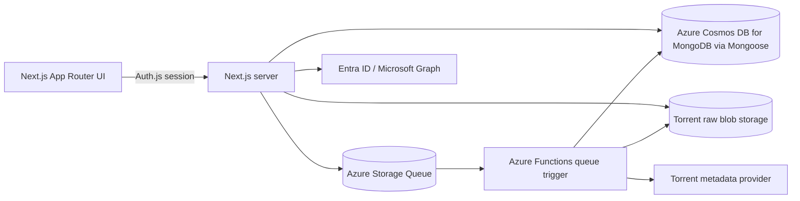

# Architecture

MyMediaVault is a monorepo for an authenticated video collection manager. Users
sign in with Entra ID, add videos by torrent info hash, and manage personal
video metadata while torrent metadata is stored once per canonical info hash.

## Runtime Components

- `apps/web`: Next.js App Router app that owns UI routes, Auth.js, Mongoose
  data access, route handlers, and server actions.
- `packages/core`: shared Mongoose, validation, storage, torrent provider, tag,
  and video/torrent job domain logic used by both runtime apps.
- `apps/functions`: Azure Functions app with queue, poison-queue, and timer
  triggers for torrent metadata processing.
- `apps/e2e`: Playwright suite that can start the local stack and authenticate
  with a real Entra test user.
- `infra/terraform`: Azure dev environment definitions.

## Deployed Topology

The web app runs as a public Azure Container App on Node.js 24. Torrent
metadata processing runs as a Node.js 22 Azure Functions Flex Consumption app
triggered by Azure Storage Queue messages. This repository owns its app resource
group, Container Apps environment, Function App, Log Analytics workspace,
workspace-based Application Insights, private raw-torrent Blob container, queue
resources, the Azure Blob backend for its own Terraform state, and the Azure
SQL database used by the dev environment.

## Request Flow

The web app redirects unauthenticated users through Auth.js and the Microsoft
Entra ID provider. Auth.js stores a server-side session, upserts the user in the
shared Mongoose `User` model, and marks admin access from configured Entra
object IDs or roles. The header avatar attempts to load the signed-in user's
photo through Microsoft Graph.

Adding a video normalizes the info hash, reuses or creates the canonical torrent,
creates a user-owned video row, creates or reuses an active SQL metadata job,
and sends a Storage Queue message when metadata is needed. The Function later
resolves the raw `.torrent` payload through a provider, stores that raw
artifact, and derives torrent metadata from it. Poison queue and timer repair
triggers keep failed deliveries auditable and re-enqueue stale non-final jobs.
