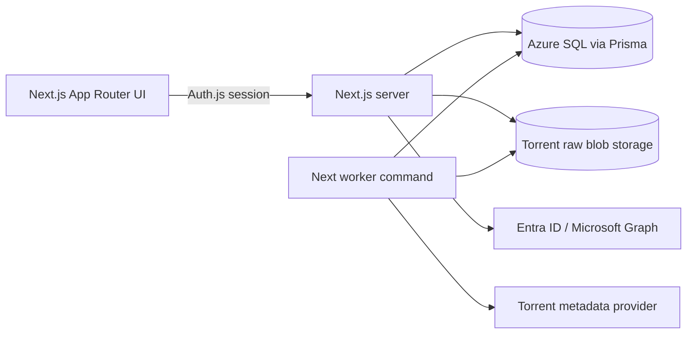

# Architecture

MyMediaVault is a monorepo for an authenticated video collection manager. Users
sign in with Entra ID, add videos by torrent info hash, and manage personal
video metadata while torrent metadata is stored once per canonical info hash.

## Runtime Components

- `apps/web`: Next.js App Router app that owns UI routes, Auth.js, Prisma data
  access, route handlers, and server actions.
- `apps/web/src/worker`: background polling worker that claims torrent
  processing jobs and resolves `.torrent` metadata.
- `apps/e2e`: Playwright suite that can start the local stack and authenticate
  with a real Entra test user.
- `infra/terraform`: Azure dev environment definitions.

## Deployed Topology

The rewritten app targets Azure Container Apps with a Node runtime. The intended
shape is one Docker image and two commands: a public Next.js web server and a
private worker process. Data persists in Azure SQL and raw torrent files are
stored in a private Azure Blob container.

## Request Flow

The web app redirects unauthenticated users through Auth.js and the Microsoft
Entra ID provider. Auth.js stores a server-side session, upserts the user in the
shared Prisma `User` model, and marks admin access from configured Entra object
IDs or roles. The header avatar attempts to load the signed-in user's photo
through Microsoft Graph.

Adding a video normalizes the info hash, reuses or creates the canonical torrent,
creates a user-owned video row, and enqueues metadata processing when needed.
The worker later resolves the raw `.torrent` payload through a provider, stores
that raw artifact, and derives torrent metadata from it. The provider remains
abstracted so deterministic fixtures and production resolver sources can share
the same orchestration flow.
