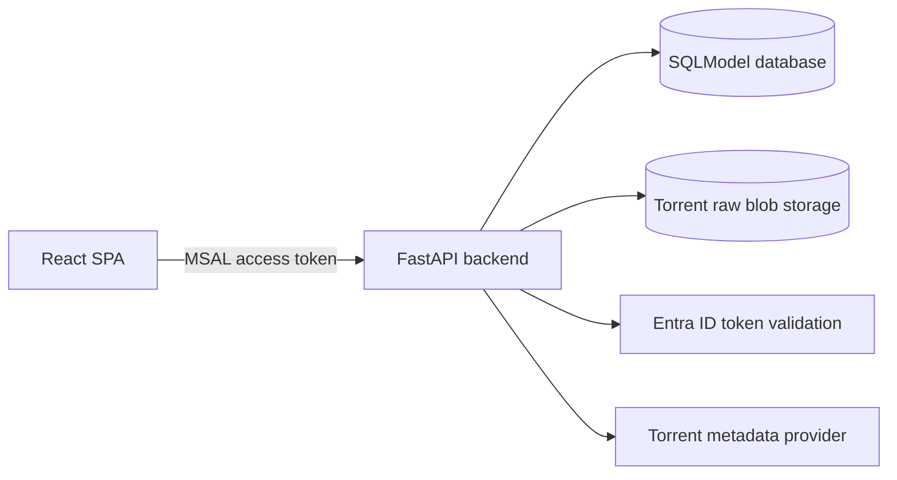

# Architecture

MyMediaVault is a monorepo for an authenticated video collection manager. Users
sign in with Entra ID, add videos by torrent info hash, and manage personal video
metadata while torrent metadata is stored once per canonical info hash.

## Runtime Components

- `apps/frontend`: Vite React SPA using MSAL for sign-in and bearer-token API calls.
- `apps/backend`: FastAPI service with SQLModel persistence, Entra validation, and
  local or Azure blob storage for raw torrent payloads.
- `apps/e2e`: Playwright suite that can start the local stack and authenticate
  with a real Entra test user.
- `infra/terraform`: Azure dev environment definitions.

## Deployed Topology

Dev deploys to Azure through GitHub Actions. The frontend is hosted on Azure
Static Web Apps. The backend runs in Azure Container Apps with external ingress,
zero minimum replicas, and a ten-minute cooldown. Data persists in Azure SQL and
raw torrent files are stored in a private Azure Blob container.

## Request Flow

The frontend redirects unauthenticated users to Entra ID. API calls acquire an
access token for `VITE_API_SCOPE` and send it as `Authorization: Bearer ...`.
FastAPI validates the token, upserts the user by Entra subject, and checks admin
roles or object IDs for admin-only tag management.

Adding a video normalizes the info hash, reuses or creates the canonical torrent,
creates a user-owned video row, and enqueues metadata processing when needed.
The backend worker later resolves the raw `.torrent` payload through a provider,
stores that raw artifact, and derives torrent metadata from it. The provider is
abstracted behind a protocol so deterministic fixtures and production resolver
sources can share the same orchestration flow.
