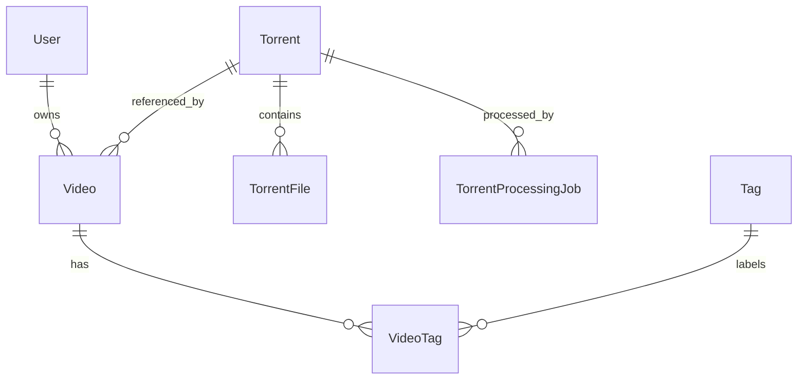

# Data Model

The active schema lives in `apps/web/prisma/schema.prisma` and is applied in
local development through `prisma db push`.

## Entity Relationships

## Tables

- `users`: local projection of Entra users keyed by internal UUID, with unique
  `email` and optional unique `entra_oid`.
- `accounts`: Auth.js OAuth account rows that store Entra access and refresh
  tokens for server-side photo fetches and sign-in bookkeeping.
- `sessions`: Auth.js database sessions keyed by unique `session_token`.
- `verification_tokens`: Auth.js verification token storage.
- `authenticators`: Auth.js WebAuthn authenticator storage.
- `torrents`: canonical torrent metadata keyed by unique normalized `info_hash`.
- `torrent_files`: ordered file list for a torrent, unique by
  `(torrent_id, position)`.
- `videos`: user-owned collection item with private title, description, and
  rating; unique by `(user_id, torrent_id)`.
- `tags`: global tag catalog keyed by unique tag name.
- `video_tags`: many-to-many links between videos and tags.
- `torrent_processing_jobs`: audit records for metadata processing attempts and
  the async work queue for background `.torrent` resolution.

## Important Constraints

Canonical torrent reuse is enforced by `torrents.info_hash`. User isolation is
enforced by querying videos with both `video.id` and `video.user_id`; multiple
users may reference the same torrent while keeping private video fields.

Rating is optional and constrained to 1 through 5 in validation code before
write operations. Tag names are trimmed, whitespace-normalized, non-empty, and
unique.

## Metadata State

`Torrent.metadata_status` tracks `pending`, `processing`, `succeeded`, or
`failed`. Failed metadata processing stores `metadata_error`; successful
processing stores `name`, `size_bytes`, `raw_blob_key`, and ordered files.
`TorrentProcessingJob` also records queued/running/completed attempts plus
worker lease fields used by the in-process background worker.
