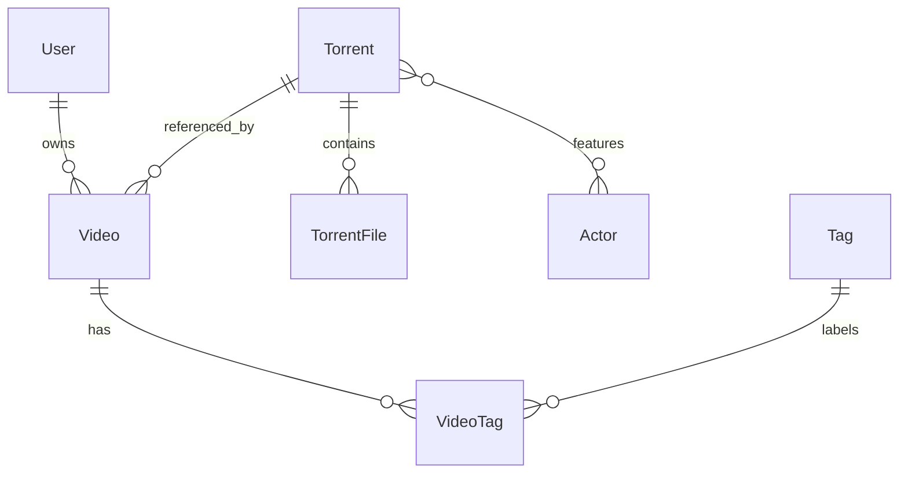

# Data Model

The active schema lives in `packages/core/src/db.ts` as Mongoose models and is
applied in local development through the shared Mongoose connection.

## Entity Relationships

## Collections

- `users`: local projection of Entra users keyed by internal ID, with unique
  `email` and optional unique `entraOid`.
- `accounts`: Auth.js OAuth account documents that store Entra access and
  refresh tokens for server-side photo fetches and sign-in bookkeeping.
- `sessions`: Auth.js database sessions keyed by unique `sessionToken`.
- `verification_tokens`: Auth.js verification token storage.
- `torrents`: canonical torrent metadata keyed by unique normalized `infoHash`.
- `actors`: shared actor catalog keyed by stable UUID with a unique actor name.
  Actor records store a name, optional description, private profile-image blob
  metadata, versioned face centroids, and capped private exemplars.
- `videos`: user-owned collection item with private title, description, and
  rating; unique by `(userId, torrentId)`.
- `tags`: global tag catalog keyed by unique tag name.
- `video_tags`: many-to-many links between videos and tags, replaced from the
  add and detail forms when a user saves tag selections.

## Important Constraints

Canonical torrent reuse is enforced by `torrents.infoHash`. User isolation is
enforced by querying videos with both `video._id` and `video.userId`; multiple
users may reference the same torrent while keeping private video fields.
Deleting the last video that references a torrent removes the orphan torrent
record, stored raw blob, and stored preview artifacts. Admin torrent deletion
cascades through dependent videos and their tag links before removing the
torrent blob and preview artifacts. Tag selections are validated against the
global `tags` catalog before write operations, so the add/detail forms can only
attach tags that already exist.

Rating is optional and constrained to 1 through 5 in validation code before
write operations. Tag names are trimmed, whitespace-normalized, non-empty, and
unique.

Actor names are trimmed, whitespace-normalized, non-empty, and unique. Actor
profile images are stored in the configured blob store under private object
keys and are served through authenticated web route handlers. Torrent actor
attribution is split between worker-owned `systemActorIds` and user-owned
`userActorIds`, so all videos that reference the same canonical torrent share
the same visible deduplicated union without automated analysis overwriting
manual curation. The legacy `actorIds` field remains a compatibility read
fallback until an existing torrent is updated. Deleting an actor removes its ID
from every attribution source before deleting the actor's profile image blob.

Worker-created actors use UUID IDs and default names such as `actor-<uuid>`.
Admins may replace that name and profile image without changing identity.
Automatic analysis never renames an existing actor or replaces its profile
image. Each actor retains up to 12 SFace exemplars with at most two from any one
torrent. The normalized centroid is recomputed whenever retained exemplars
change. Exemplars and centroids are versioned by face-model recipe and remain
private MongoDB fields. Torrent deletion preserves actor-owned evidence; only
explicit actor deletion removes it.

## Metadata State

`Torrent.metadataStatus` tracks `pending`, `processing`, `succeeded`, or
`failed`. Failed metadata processing stores `metadataError` and
`metadataFailureKind`; successful processing stores `name`, `sizeBytes`,
`rawBlobKey`, and ordered files. The VM worker uses the `torrents` collection as
the metadata queue. `metadataNextAttemptAt` controls retry scheduling,
`metadataLeaseUntil` protects in-flight claims, attempt and timing fields record
processing progress, and `metadataDiagnostics` stores resolver-level failure
details.

## Preview State

`Torrent.previewStatus` tracks `pending`, `processing`, `succeeded`, `partial`,
or `failed`. The VM worker preview pipeline only claims torrents whose metadata
has succeeded and whose raw torrent blob is available. Successful preview output
stores a contact sheet in `previewSheet` and up to nine frame records in
`previewFrames`; both store private R2 object keys and dimensions. Partial
preview output is retained for diagnostics but is presented as degraded to
users.

`previewDiagnostics` stores the `torrent-preview` artifact contract version and
fingerprint, selected file, downloaded bytes, elapsed time, status reason,
warnings, and low-level torrent diagnostics. Engine-specific diagnostic details,
including bounded anchor retry summaries, live in the mixed `details` payload.
The worker increments `previewAttempts` and updates `previewLastAttemptAt`
whenever it claims a torrent.

The VM worker automatically retries `failed` and `partial` previews using its
configured retry-delay schedule. Total attempts equal one initial attempt plus
the number of configured delays. `previewNextAttemptAt` stores the next
scheduled retry timestamp. Admins can reset a torrent preview attempt count from
torrent management, which sets the preview status back to `pending`, clears the
scheduled retry timestamp, and keeps existing artifacts. The worker regenerates
`succeeded`, `partial`, and `failed`
previews when their recorded `torrent-preview` artifact contract version or
fingerprint is missing or differs from the worker's current library recipe.
Artifact-stale claims reset `previewAttempts` for the new recipe.

## Actor Analysis State

`Torrent.actorAnalysisStatus` tracks `pending`, `processing`, `succeeded`, or
`failed`. The sequential VM-worker actor pipeline claims durable preview frames,
stores detected assignments in `systemActorIds`, and leaves `userActorIds`
untouched. A successful analysis with no qualifying main actor stores an empty
system list.

`actorAnalysisAttempts`, attempt/update timestamps, `actorAnalysisLeaseUntil`,
`actorAnalysisFingerprint`, `actorAnalysisError`, and compact diagnostics record
queue state. Replacing preview artifacts queues downstream analysis while
preserving previous system assignments until replacement analysis succeeds.
Expired leases return to `pending`; unexpected failures retry immediately up to
three total attempts. Admin torrent management can reset one selected torrent
to `pending`.
