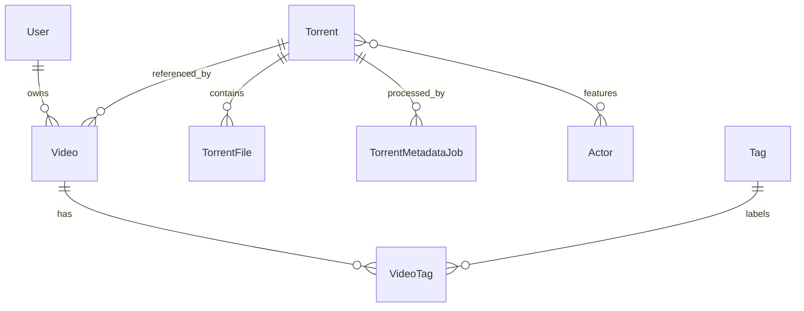

# Data Model

The active schema lives in `packages/core/src/db.ts` as Mongoose models and is
applied in local development through the shared Mongoose connection.

## Entity Relationships

## Collections

- `users`: local projection of Entra users keyed by internal ID, with unique
  `email` and optional unique `entraOid`.
- `accounts`: Auth.js OAuth account documents that store Entra access and
  refresh tokens for server-side photo fetches and sign-in bookkeeping.
- `sessions`: Auth.js database sessions keyed by unique `sessionToken`.
- `verification_tokens`: Auth.js verification token storage.
- `torrents`: canonical torrent metadata keyed by unique normalized `infoHash`.
- `actors`: shared actor catalog keyed by unique actor name. Actor records store
  a name, optional description, and private profile-image blob metadata.
- `videos`: user-owned collection item with private title, description, and
  rating; unique by `(userId, torrentId)`.
- `tags`: global tag catalog keyed by unique tag name.
- `video_tags`: many-to-many links between videos and tags, replaced from the
  add and detail forms when a user saves tag selections.
- `torrent_metadata_jobs`: queue and audit records for metadata processing
  attempts.

## Important Constraints

Canonical torrent reuse is enforced by `torrents.infoHash`. User isolation is
enforced by querying videos with both `video._id` and `video.userId`; multiple
users may reference the same torrent while keeping private video fields.
Deleting the last video that references a torrent removes the orphan torrent
record, its metadata job history, stored raw blob, and stored preview artifacts. Admin torrent
deletion cascades through dependent videos and their tag links before removing
the torrent blob and preview artifacts. Tag selections are validated against the global `tags`
catalog before write operations, so the add/detail forms can only attach tags
that already exist.

Rating is optional and constrained to 1 through 5 in validation code before
write operations. Tag names are trimmed, whitespace-normalized, non-empty, and
unique.

Actor names are trimmed, whitespace-normalized, non-empty, and unique. Actor
profile images are stored in the configured blob store under private object
keys and are served through authenticated web route handlers. Torrent actor
attribution is stored as `torrents.actorIds`, so all videos that reference the
same canonical torrent share the same actor list. Deleting an actor removes its
ID from every torrent before deleting the actor's profile image blob.

## Metadata State

`Torrent.metadataStatus` tracks `pending`, `processing`, `succeeded`, or
`failed`. Failed metadata processing stores `metadataError`; successful
processing stores `name`, `sizeBytes`, `rawBlobKey`, and ordered files.
`TorrentMetadataJob` records `queued`, `processing`, `succeeded`, and
`failed` attempts. `queueEnqueuedAt` records when the job last became eligible
for the event-driven worker. Timing fields (`lastDequeuedAt`, `startedAt`, and
`finishedAt`) support duplicate-job handling and stale processing repair.

## Preview State

`Torrent.previewStatus` tracks `pending`, `processing`, `succeeded`, `partial`,
or `failed`. The VM-hosted preview worker only claims torrents whose metadata
has succeeded and whose raw torrent blob is available. Successful preview output
stores a contact sheet in `previewSheet` and up to nine frame records in
`previewFrames`; both store private R2 object keys and dimensions. Partial
preview output is retained for diagnostics but is presented as degraded to
users.

`previewDiagnostics` stores the `torrent-preview` artifact contract version and
fingerprint, selected file, downloaded bytes, elapsed time, strategy, warnings,
failure reason, and low-level torrent diagnostics. Frame metadata includes
whether the Pydantic AI ranker accepted the selected frame when that signal is
available. The worker increments `previewAttempts` and updates
`previewLastAttemptAt` whenever it claims a torrent.

The preview worker regenerates `succeeded` and `partial` previews when their
recorded `torrent-preview` artifact contract version or fingerprint differs
from the worker's current library recipe. Current `failed` results remain
terminal unless they are manually requeued.
