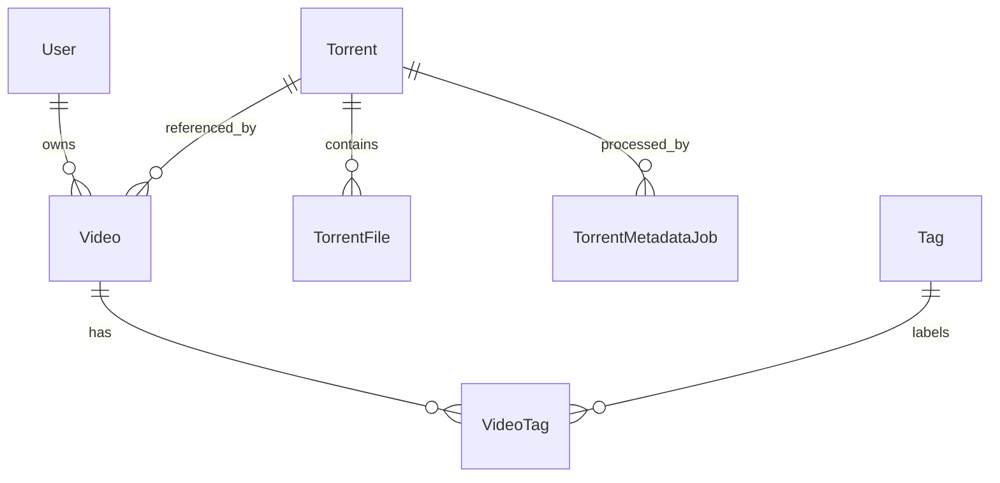

# Data Model

The active schema lives in `packages/core/src/db.ts` as Mongoose models and is
applied in local development through the shared Mongoose connection.

## Entity Relationships

## Collections

- `users`: local projection of Entra users keyed by internal ID, with unique
  `email` and optional unique `entraOid`.
- `accounts`: Auth.js OAuth account documents that store Entra access and
  refresh tokens for server-side photo fetches and sign-in bookkeeping.
- `sessions`: Auth.js database sessions keyed by unique `sessionToken`.
- `verification_tokens`: Auth.js verification token storage.
- `torrents`: canonical torrent metadata keyed by unique normalized `infoHash`.
- `videos`: user-owned collection item with private title, description, and
  rating; unique by `(userId, torrentId)`.
- `tags`: global tag catalog keyed by unique tag name.
- `video_tags`: many-to-many links between videos and tags, replaced from the
  add and detail forms when a user saves tag selections.
- `torrent_metadata_jobs`: audit records for Storage Queue-backed metadata
  processing attempts.

## Important Constraints

Canonical torrent reuse is enforced by `torrents.infoHash`. User isolation is
enforced by querying videos with both `video._id` and `video.userId`; multiple
users may reference the same torrent while keeping private video fields.
Deleting the last video that references a torrent removes the orphan torrent
record, its metadata job history, and the stored raw blob. Admin torrent
deletion cascades through dependent videos and their tag links before removing
the torrent blob. Tag selections are validated against the global `tags`
catalog before write operations, so the add/detail forms can only attach tags
that already exist.

Rating is optional and constrained to 1 through 5 in validation code before
write operations. Tag names are trimmed, whitespace-normalized, non-empty, and
unique.

## Metadata State

`Torrent.metadataStatus` tracks `pending`, `processing`, `succeeded`, or
`failed`. Failed metadata processing stores `metadataError`; successful
processing stores `name`, `sizeBytes`, `rawBlobKey`, and ordered files.
`TorrentMetadataJob` records `queued`, `processing`, `succeeded`, `failed`, and
`dead_lettered` attempts. Queue timing fields (`queueEnqueuedAt`,
`lastDequeuedAt`, `startedAt`, and `finishedAt`) support duplicate-message
handling, poison-queue auditing, and timer-trigger repair.
