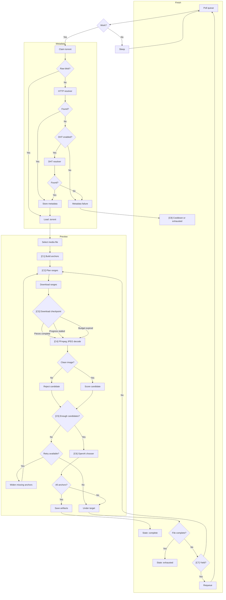

# Worker

## VM Worker 1.0

`apps/vm-worker` is a single long-running process for torrent processing and
actor identification. Torrent metadata resolution and preview generation share
one FIFO lifecycle because both are stages of obtaining enough torrent data to
produce useful preview frames. Actor analysis remains a separate sequential
downstream pipeline.

The `torrents` collection is the durable queue. There is no separate job
collection and no durable preview retry ladder. Each active torrent owns one of
`MMV_PREVIEW_WORKER_MAX_CONCURRENCY` slots. An active session resolves metadata
when needed, downloads useful ranges, decodes clean per-anchor candidates, asks
the OpenAI-backed ranker to choose one frame per eligible anchor, and continues
downloading when the result is not yet good enough. OpenAI is a chooser rather
than a gate: local download, FFmpeg, and image checks decide which anchors are
eligible; OpenAI chooses the best frame for each eligible anchor. If the selected
media file is fully downloaded but the engine still cannot produce all target
frames, the session becomes `exhausted` with the current artifact preserved.

With no queue pressure, a sparse swarm may retain its slot indefinitely and retry
preview generation with the same libtorrent handle after each checkpoint.
No-progress continuation logs are throttled, while the retained handle can
continue downloading. Under queue pressure, an incomplete session that made no
useful byte or piece progress yields at the next engine checkpoint, stores
libtorrent resume data, releases its handle, and rejoins the FIFO tail. HTTP,
DHT, or external service failures use one fixed cooldown timestamp to avoid hot
loops. Bounded metadata, permanent media, or bounded external service failures
become `exhausted`.

## Worker Workflow



Configuration impact:

| Ref | Stage | Configuration | Default | Effect |
| --- | --- | --- | --- | --- |
| C1 | Build anchors | `MMV_PREVIEW_TARGET_FRAMES` | `9` | Sets how many timeline anchors must produce selected frames before the preview is `complete`. |
| C2 | Plan ranges and retry widening | `MMV_PREVIEW_ANCHOR_RETRY_RANGE_MB` | `[64,128,256,384,512,768]` | Controls the retry ladder. Each retry widens byte ranges only for anchors that still lack enough clean candidates. Retry remains available only while the ladder has another range value and the current preview attempt still has download, decode, and overall time remaining. |
| C3 | Download checkpoint | `MMV_PREVIEW_DOWNLOAD_PROGRESS_TIMEOUT_SECONDS`, engine `max_download_time_seconds` | `300s`, `1800s` | The worker ends the current download attempt and tries decode when requested pieces complete, selected-file byte progress stalls for the progress timeout, or the attempt's download-time budget expires. The checkpoint is not a terminal failure; FFmpeg clean extraction decides which anchors have enough available bytes. |
| C4 | FFmpeg JPEG decode | engine `max_decode_time_seconds`, `MMV_PREVIEW_EXTRACT_FRAMES_PER_ANCHOR` | `90s`, `7` | Bounds decode time and sets how many JPEG candidates to attempt around each anchor. |
| C5 | Enough candidates | `MMV_PREVIEW_MIN_SELECTOR_CANDIDATES_PER_ANCHOR` | `2` | An anchor becomes eligible for OpenAI only after it has at least this many clean local candidates. |
| C6 | OpenAI chooser | `MMV_PREVIEW_MAX_SELECTOR_CANDIDATES_PER_ANCHOR`, engine `llm_timeout_seconds` | `4`, `8s` | Caps how many clean candidates per eligible anchor are sent to OpenAI and bounds the chooser request duration. |
| C7 | Yield decision | `MMV_PREVIEW_SESSION_FAIRNESS_SECONDS` | `7200s` | Under queue pressure, a sparse session yields after this lifetime or after a no-progress checkpoint. Without queue pressure, it keeps retrying in the same session. |
| C8 | Cooldown or exhausted | `MMV_PREVIEW_EXTERNAL_FAILURE_COOLDOWN_SECONDS`, `MMV_PREVIEW_FAILURE_LIMIT` | `300s`, `3` | External failures cool down before retrying. Once the failure limit is reached, the torrent becomes `exhausted`. |

In the workflow, `Retry available?` means the current preview attempt can still
try another widened range from `MMV_PREVIEW_ANCHOR_RETRY_RANGE_MB` and still has
remaining download, decode, and overall attempt time.

Preview download attempts stop at a checkpoint, not at a percentage threshold.
The worker proceeds to decode when the requested pieces complete, when
selected-file byte progress has stalled for
`MMV_PREVIEW_DOWNLOAD_PROGRESS_TIMEOUT_SECONDS`, or when the current attempt's
download-time budget is exhausted. Torrent-piece completeness is diagnostic
information and can guide retries, but it is not the decode gate. FFmpeg clean
extraction is the practical proof that enough source bytes exist for an anchor
candidate.

FFmpeg extracts anchor candidates with bounded single-frame input seeks. This
avoids long post-seek scans on high-bitrate or slow-to-decode files while still
requiring each JPEG candidate to have a decoded timestamp inside the anchor
window.

`MMV_PREVIEW_DOWNLOAD_PROGRESS_TIMEOUT_SECONDS` should stay short enough to
avoid wasting a worker slot on an inactive range. The default is `300` seconds.
Increasing it should be treated as swarm tuning, not as the fix for missing
candidates: a stalled attempt is allowed to decode available bytes and then
retry only the anchors that still lack enough clean candidates.

The download-time budget is the wall-clock time available to download ranges
within one preview generation attempt. The initial range download is bounded by
`MMV_PREVIEW_MAX_DOWNLOAD_TIME_SECONDS` and by the overall preview attempt time
after reserving decode time. Retry downloads share the remaining download-time
budget after earlier range downloads have already spent time.

The worker yields a retryable torrent only when queue pressure exists and the
active session reached the fairness limit or made no useful byte/piece progress.
Otherwise it keeps the libtorrent handle active and retries in the same session.

## Preview Retry

Preview retry is in-session and anchor-focused. The worker does not create a
separate durable retry job for each anchor. A retry starts after the initial
decode and local candidate scoring identify anchors with too few clean
candidates.

For each configured value in `MMV_PREVIEW_ANCHOR_RETRY_RANGE_MB`, the engine:

1. Builds widened byte ranges only for anchors that still lack the minimum clean
   selector candidates.
2. Prioritizes those pieces in the retained libtorrent session.
3. Downloads until requested pieces complete, progress stalls, or the remaining
   download budget expires.
4. Attempts FFmpeg extraction from the available media bytes.
5. Keeps only clean JPEG candidates that pass local validation.
6. Recomputes missing anchors and stops early once every target anchor is
   eligible or the retry ladder/budgets are exhausted.

The selector may see fewer than the target anchor count when some anchors never
produce enough clean candidates. In that case OpenAI still chooses exactly one
candidate for each eligible anchor, and the preview result is partial or failed
depending on whether any selected frames exist.

## OpenAI Selection

OpenAI selection receives local candidates only. The engine caps candidates per
eligible anchor with `MMV_PREVIEW_MAX_SELECTOR_CANDIDATES_PER_ANCHOR`. The
structured output model is built at runtime for the eligible anchor count, so
the response must contain exactly one selected candidate ID for each eligible
anchor. Pydantic validates the response shape before the worker accepts it.

Selector timeouts are retried once immediately with the same candidate set. If
the retry also fails, or if another selector service failure occurs, the worker
preserves the current artifact, increments the failure counter, applies
`MMV_PREVIEW_EXTERNAL_FAILURE_COOLDOWN_SECONDS`, and retries later until
`MMV_PREVIEW_FAILURE_LIMIT` is reached.

## Artifact Persistence

When preview generation returns selected frames, the worker uploads JPEG frame
artifacts and the rendered preview sheet to the configured blob store, then
stores their keys, dimensions, selected file diagnostics, artifact version, and
artifact fingerprint on the torrent document. A succeeded preview marks the
torrent `complete`. An under-target result can preserve a usable partial
artifact while the torrent remains retryable or later becomes `exhausted`.

Replacing preview artifacts resets actor analysis to `pending`, clears the actor
analysis lease/error fields, and preserves visible actor assignments until the
new analysis completes.

## Torrent States

| State | Meaning |
| --- | --- |
| `queued` | Waiting in FIFO order. |
| `running` | Owns a worker slot. `processingPhase` identifies the current stage. |
| `partial` | Has usable frames and remains queued for improvement. |
| `complete` | Has one selected frame for every target anchor. |
| `exhausted` | Needs admin attention after a permanent failure, bounded external failure, or fully downloaded media that cannot produce all target frames. |
| `cancelled` | Removed from scheduling by an admin. |

Admins can `Queue again` or `Cancel` torrent processing. Queueing again clears
the failure counter and cooldown while preserving existing artifacts.

## Persistent Cache

MongoDB remains authoritative. Downloaded torrent bytes and libtorrent resume
data live in a bounded rebuildable cache at `MMV_PREVIEW_CACHE_DIR`. Deployments
must bind mount this path so container replacement does not discard sparse-swarm
progress. The cache uses an LRU budget controlled by `MMV_PREVIEW_CACHE_MAX_MB`.

## Actor Analysis

Actor analysis consumes durable preview frames and runs sequentially. Only
complete torrents with durable frames are eligible. Replacing preview artifacts
queues actor analysis again while preserving visible assignments until the
replacement run completes. A complete preview with no qualifying face cluster is
a successful actor-analysis run with an empty detected actor list.

## Configuration

Run locally:

```bash
cd apps/vm-worker
cp .env.example .env
uv run mymediavault-vm-worker
```

Important variables:

| Variable | Purpose |
| --- | --- |
| `MONGODB_URI` | MongoDB connection. |
| `OPENAI_API_KEY` | Required by OpenAI-backed frame selection. |
| `MMV_PREVIEW_WORKER_ENABLED` | Enables unified torrent processing. |
| `MMV_PREVIEW_WORKER_MAX_CONCURRENCY` | Maximum active torrent sessions. Defaults to `20`. |
| `MMV_PREVIEW_WORKER_POLL_INTERVAL_SECONDS` | Idle FIFO poll interval. Defaults to `5`. |
| `MMV_PREVIEW_REPAIR_STALE_PROCESSING_MINUTES` | Crash-recovery lease threshold. Defaults to `120`. |
| `MMV_PREVIEW_SESSION_FAIRNESS_SECONDS` | Queue-pressure fairness lifetime. Defaults to `7200`. |
| `MMV_PREVIEW_FAILURE_LIMIT` | Metadata and external processing failure limit. Defaults to `3`. |
| `MMV_PREVIEW_EXTERNAL_FAILURE_COOLDOWN_SECONDS` | Fixed resolver/service cooldown. Defaults to `300`. |
| `MMV_PREVIEW_CACHE_DIR` | Persistent libtorrent cache path. |
| `MMV_PREVIEW_CACHE_MAX_MB` | Bounded cache budget. Defaults to `32768`. |
| `MMV_PREVIEW_TARGET_FRAMES` | Required selected frame count. Defaults to `9`. |
| `MMV_PREVIEW_EXTRACT_FRAMES_PER_ANCHOR` | Decode attempts per anchor. Defaults to `7`. |
| `MMV_PREVIEW_MIN_SELECTOR_CANDIDATES_PER_ANCHOR` | Minimum clean candidates required before an anchor can be selected. Defaults to `2`. |
| `MMV_PREVIEW_MAX_SELECTOR_CANDIDATES_PER_ANCHOR` | Maximum clean candidates per anchor sent to OpenAI. Defaults to `4`. |
| `MMV_PREVIEW_ANCHOR_RETRY_RANGE_MB` | In-session widened anchor ranges. |
| `MMV_PREVIEW_DOWNLOAD_PROGRESS_TIMEOUT_SECONDS` | Stall checkpoint interval. Defaults to `300`. |
| `MMV_TORRENT_PROVIDER` | `http` or deterministic local `fake`. |
| `MMV_TORRENT_RESOLVER_URLS` | HTTP `.torrent` resolver templates. |
| `MMV_TORRENT_DHT_FALLBACK_ENABLED` | Enables libtorrent DHT metadata fallback. |
| `MMV_TORRENT_DHT_TIMEOUT_SECONDS` | DHT metadata timeout. Defaults to `600`. |
| `MMV_ACTOR_ANALYSIS_WORKER_ENABLED` | Enables sequential actor analysis. |

See `apps/vm-worker/.env.example` for the complete list.

## Diagnostics

Console logs stay at `INFO`. Rotated redacted JSON Lines `DEBUG` logs include
queue claims, phases, byte and piece progress, peer counts, yields, cooldowns,
resume persistence, and releases. MongoDB stores the current state, phase,
queue timestamp, lease, cooldown, failure count, last outcome, last error, and
preview diagnostics directly on each torrent.

## Migration

Worker `1.0.0` is a one-way replacement. Stop older workers before running:

```bash
cd apps/vm-worker
MONGODB_URI=... uv run python scripts/migrate_processing_queue_v1.py \
  --backup ../../tmp/torrents-before-worker-1.0.json
```

The migration preserves raw metadata and preview artifacts, maps usable
nine-frame artifacts to `complete`, usable partial artifacts to `partial`, and
other valid torrents to `queued`.
